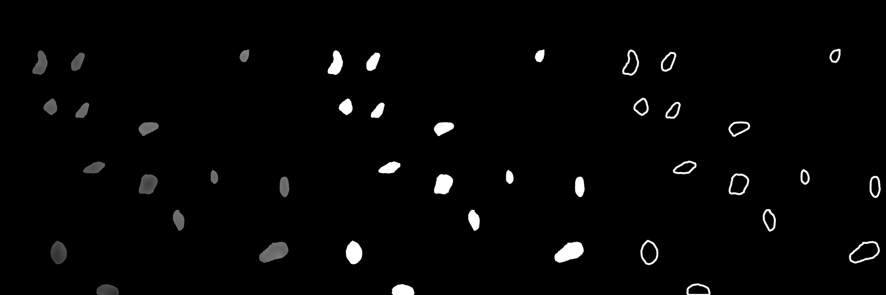

# SAM4EM
## Zero Shot multiple particle segmentation and tracking  in liquid phase TEM

* * * * * *
## Abstract

Liquid phase transmission electron microscopy (LPTEM) is an emerging microscopy technique with an unprecedented combination of spatial and temporal resolution, making it a promising method for single particle tracking. However, the lack of standardized video processing frameworks that can successfully identify and track nanoparticles moving in noisy LPTEM videos has impeded progress in the field to develop this method as a single particle tracking tool. We demonstrate the first implementation of the SAM 2 video segmentation foundation model for experimental microscopy data analysis, showing that SAM 2 successfully segments LPTEM videos in a zero-shot manner. Leveraging that, we present SAM4EM, a comprehensive suite with a promptable video segmentation module in conjunction with a particle tracking and statistical analysis module, as an end-to-end LPTEM analysis framework for single particle tracking. SAM4EM successfully segments and analyzes LPTEM videos with high accuracy compared to the state-of-the-art methods.
* * * * * *

## Installation
-First create a conda enviornment for SAM4EM using `conda create -n SAM4EM`

-Next install the Meta Segment Anything Model 2 (SAM 2) module inside this envirnment by activating your environment first `conda activate SAM4EM`. For installing SAM 2, follow the installations on the [SAM 2 github repository](https://github.com/facebookresearch/sam2). In short, first install `python>=3.10` and `torch>=2.5.1`:
### -For GPU with CUDA 11.7:
`conda install pytorch==2.3.1 torchvision torchaudio pytorch-cuda=11.7 -c pytorch -c nvidia`
### -For CPU only:
`conda install pytorch==2.3.1 torchvision torchaudio cpuonly -c pytorch`

Then clone Meta SAM 2 repository in the desire directory:

`git clone https://github.com/meta/SAM2.git`

`cd sam2`

`pip install -e ".[notebooks]"`

Next download all most recent sam2 model checkpoints into checkpoint directory:

.[sam2.1_hiera_tiny.pt](https://dl.fbaipublicfiles.com/segment_anything_2/092824/sam2.1_hiera_tiny.pt)

.[sam2.1_hiera_small.pt](https://dl.fbaipublicfiles.com/segment_anything_2/092824/sam2.1_hiera_small.pt)

.[sam2.1_hiera_base_plus.pt](https://dl.fbaipublicfiles.com/segment_anything_2/092824/sam2.1_hiera_base_plus.pt)

.[sam2.1_hiera_large.pt](https://dl.fbaipublicfiles.com/segment_anything_2/092824/sam2.1_hiera_large.pt)

-For the Particle tracking module install the following packages:

`pip install -r requirements.txt`

-Next add the Jupyter notebook in this repository and your data folder to the notebooks directory of SAM2 to segment videos and analyze spatiotemporal trajectories

Here is an example of how the masklets of the tracked particles look like in the 

* * * * * *
## Acknowledgements 

This project is funded by the National Science Foundation Division of Chemical, Bioengineering, Environmental, and Transport Systems under award 2338466, the American Chemical Society Petroleum Research Fund under award 67239-DNI5, and the Georgia Tech Institute for Matter and Systems, Exponential Electronics seed grant.
